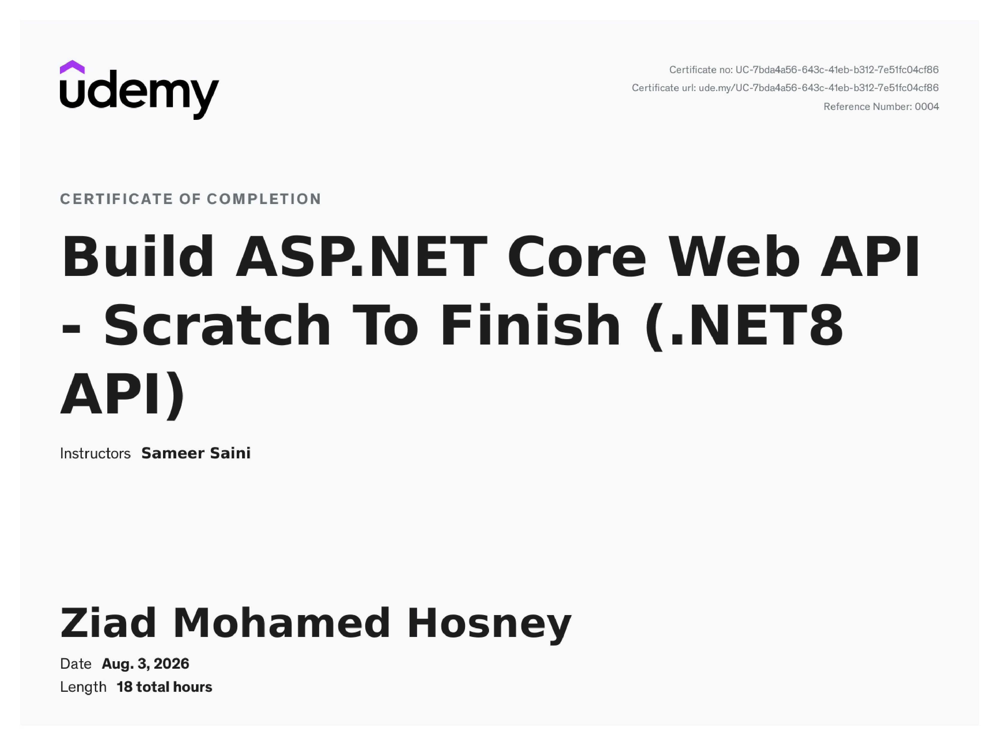

---

### **Course Description**

## Building Modern REST APIs with ASP.NET Core and .NET 8

This course provides a comprehensive introduction to developing **RESTful Web APIs** using **ASP.NET Core**, **.NET 8**, **Entity Framework Core**, and **SQL Server**. It follows a practical, project-based approach that focuses on building production-ready APIs while introducing the architecture, patterns, and best practices used in modern backend development.

Designed for developers with basic knowledge of C# and ASP.NET, the course gradually progresses from API fundamentals to advanced topics such as authentication, authorization, validation, and optimized data querying.

### Course Overview

The learning journey begins by introducing the principles of REST and the structure of an ASP.NET Core Web API project. From there, the course explores domain modeling, dependency injection, and the creation of a SQL Server database using **Entity Framework Core Code-First Migrations**.

Throughout the course, students build a complete Web API that manages regions  walking tandrails in New Zealand. This project serves as the foundation for implementing real-world backend features while following clean architecture principles.

The course also demonstrates how to separate domain models from DTOs, apply the Repository Pattern, and simplify object mapping using **AutoMapper**. API endpoints are tested using **Swagger UI** and **Postman**, providing practical experience with professional development workflows.

Security is introduced through **JWT Authentication** and **Role-Based Authorization**, followed by the implementation of **ASP.NET Core Identity** for user registration, authentication, and role management. Advanced API capabilities, including filtering, sorting, and pagination, are also covered to improve API usability and performance.

### Topics Covered

The course includes extensive coverage of modern ASP.NET Core Web API development, including:

- RESTful API principles and architecture
- ASP.NET Core Web API with .NET 8
- Dependency Injection
- Entity Framework Core
- SQL Server integration
- Code-First Migrations
- Domain Models and DTOs
- Repository Pattern
- AutoMapper
- Asynchronous Programming with async/await
- Input validation
- Clean coding practices
- JWT Authentication
- ASP.NET Core Identity
- Role-Based Authorization
- Swagger UI
- Postman
- CRUD operations
- Filtering, Sorting, and Pagination

### Practical Project

A complete REST API is developed throughout the course, allowing students to apply each concept in a realistic backend application. The project includes:

- Designing and implementing database models
- Creating RESTful endpoints
- Performing CRUD operations
- Securing endpoints with JWT authentication
- Managing users and roles
- Mapping entities with AutoMapper
- Implementing repository-based data access
- Testing APIs using Swagger and Postman
- Adding filtering, sorting, and pagination support

---

