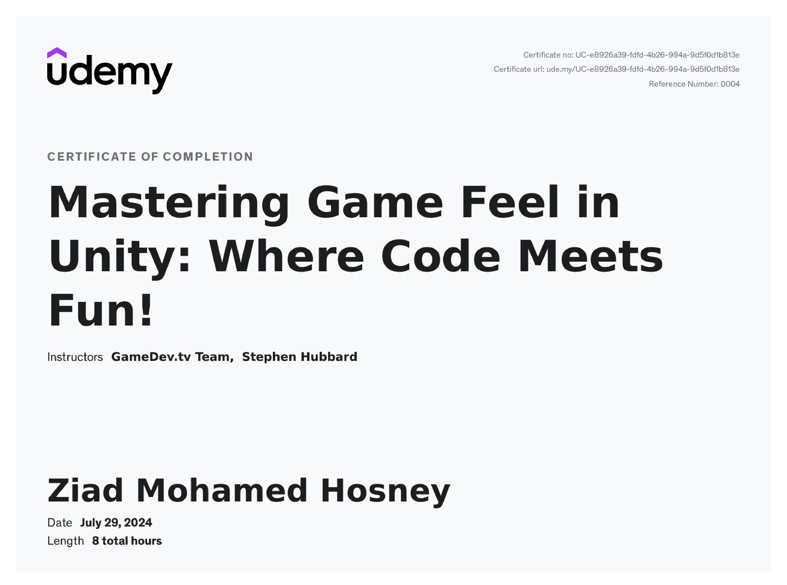

---

### **Course Description**

This course focuses on enhancing **game feel** by implementing engaging **mechanics, systems, and visual effects** that make gameplay more responsive and satisfying. Building on a solid foundation in **C# and Unity**, you’ll learn both programming and design techniques that elevate the player experience.

You’ll develop skills in:

* **C# programming:** structs, interfaces, centralized input, and design patterns
* **Unity techniques:** screen shake, post-processing, 2D lighting, particles, masking, Unity events, and tilemap prefabs
* **Audio and feedback systems:** building a scalable **Audio Manager** and refining player and weapon responsiveness

Using a 2D side-scrolling shooter as a base, you’ll expand it into a polished, fun-to-play experience with smooth controls, dynamic visuals, and satisfying audio-visual feedback.

Suitable for **beginner to intermediate Unity developers**, this course is ideal for those looking to refine their technical and design skills. You’ll receive **lifetime access**, **active community support**, and guidance from experienced instructors who clearly explain both coding and design concepts.

---

