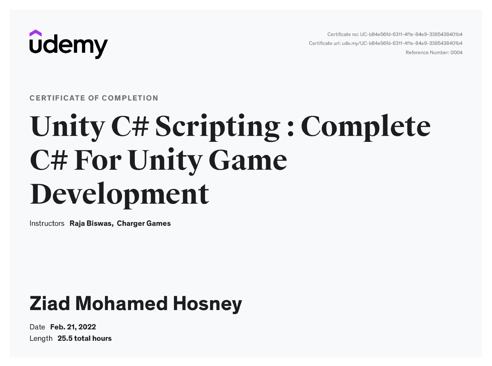

---
### **Course Description**

## Master C# Scripting in Unity – From Beginner to Game Developer

Want to start creating games with **Unity** but not sure where to begin with **C# scripting**?
This course will teach you everything you need to know — step by step — from the very basics of programming to writing advanced, reusable scripts for real Unity projects.

All content is fully compatible with **Unity 6**, **Unity 2023**, **2022**, and earlier versions.

### 🎯 What You’ll Learn

* Master **C# programming** from absolute beginner to advanced level
* Understand **core programming concepts** and logic
* Learn **Unity’s API** and scripting workflow
* Apply **Object-Oriented Programming (OOP)** in game development
* Create **ready-to-use and reusable C# scripts**
* Implement **basic AI systems** for enemies and gameplay
* Develop **Android and mobile games** using Unity
* Learn **version control** with GitHub, Bitbucket, and SourceTree

### 🧠 Course Overview

Taught by **Charger Games**, a YouTube creator with thousands of students worldwide, this course makes complex programming concepts simple and fun to learn — even if you have no prior experience.

Through **100+ lectures** and **20+ hours of hands-on content**, you’ll build a strong foundation in Unity and C#, learning by creating multiple interactive examples and mini-games. Each chapter includes **quizzes and practical exercises** to reinforce your knowledge.

You’ll start from installing **Unity and Visual Studio**, then move on to scripting, understanding Unity’s component system, building small projects, and finally creating **complete games for mobile platforms**.

### 💪 Why Take This Course

By the end, you’ll be confident in your ability to:

* Write professional-quality C# code in Unity
* Build your own 2D or 3D games
* Prototype gameplay mechanics quickly
* Use Git and version control in your workflow
* Advance your career in **game development** or start your own indie projects

---

