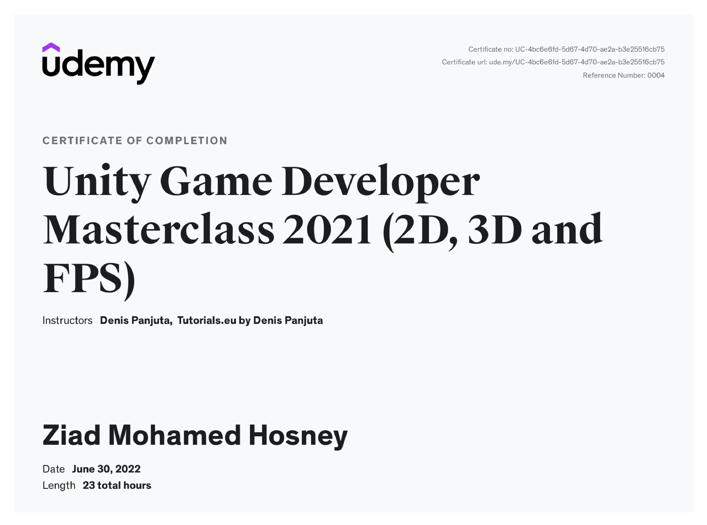

---
### **Course Description**

This comprehensive course provides a complete introduction to game development using Unity and C#, designed for beginners with no prior coding or development experience. Students will learn to build both 2D and 3D games while mastering essential Unity features such as physics, animation, scene management, environment design, character control, and monetization systems.

Throughout the course, participants will create multiple projects, including:

* A **3D Platformer**, focusing on physics and player movement.
* A **2D Space Invader clone**, introducing 2D mechanics and systems.
* A **Fruit Ninja–style mobile game**, emphasizing interaction and gameplay design.
* A **First-Person Shooter / Zombie Survival game**, covering animations, enemy AI, health systems, and level design.
* A **Tycoon-style final project**, applying advanced mechanics and monetization strategies.

By the end, learners will have a strong foundation in Unity game development, the skills to create and publish their own games, and an understanding of how to monetize them through ads and in-app purchases.

The course is led by **Denis Panjuta**, an experienced instructor with over 200,000 students worldwide, supported by a dedicated development team providing assistance throughout the learning process.

---

