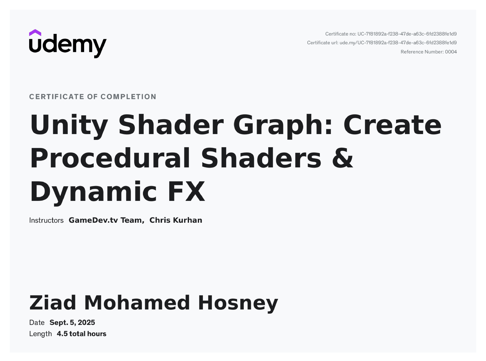

---

### **Course Description**

This course offers a comprehensive introduction to Unity’s Shader Graph, empowering learners to design and implement advanced visual effects that elevate game aesthetics and performance. Through a structured, hands-on approach, participants will explore how to create realistic materials, dynamic lighting, and custom shader-based effects for immersive gameplay experiences.

Guided by industry professionals, the course combines clear theoretical explanations with practical, project-based exercises to ensure a deep and applicable understanding of Shader Graph.

---

### **Key Learning Outcomes**

* Build and customize materials that enhance visual realism.
* Design dynamic lighting and responsive visual effects.
* Create procedural textures for added depth and atmosphere.
* Apply advanced shader techniques to support visual storytelling.
* Integrate Shader Graph workflows efficiently into game projects.

---

### **Features**

* Step-by-step video tutorials and guided demonstrations.
* Practical projects and exercises for applied learning.
* Lifetime access to all course materials and future updates.
* Instructor and community support via Q&A.

---

