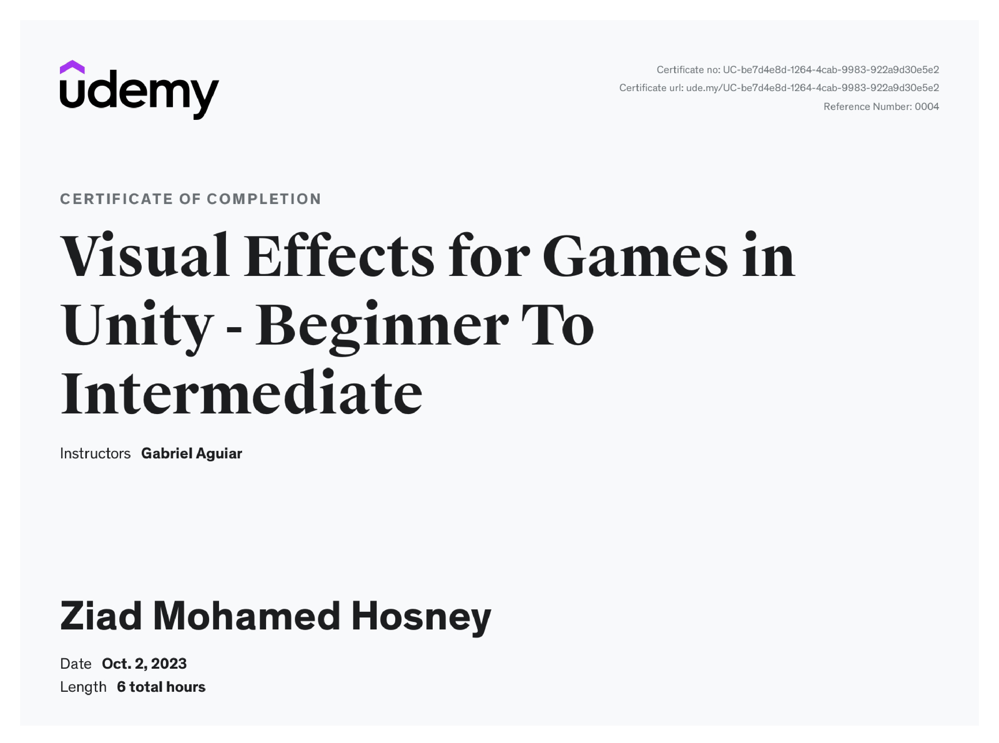

---
### **Course Description**

This course is about the creation of VFX for Games with Unity. You'll start learning how to create Magic Spells, Fireballs, Special Skills and more effects for games. It will take you from a Beginner standpoint to an Intermediate level in Game VFX. It contains the theory, the practice and the creative liberty you will need in your future Visual Effects career.

---

