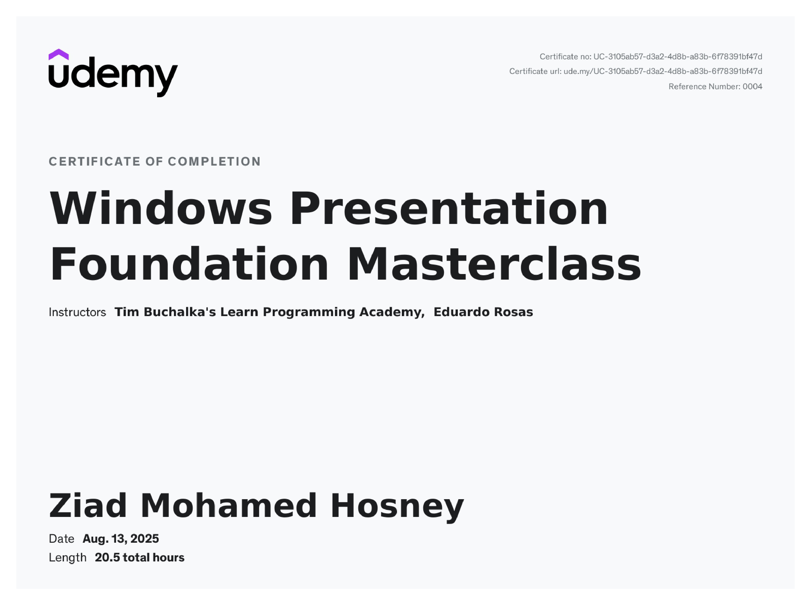

---

### **Course Description**

## Master WPF and Build Modern Desktop Applications with C#

Are you a C# developer looking to level up your skills, land better job opportunities, or expand your résumé with in-demand technologies?
This course will take you from basic programming knowledge to building powerful, real-world desktop applications using **Windows Presentation Foundation (WPF)** — one of Microsoft’s most versatile and professional UI frameworks.

### 💡 Why Learn WPF?

WPF is part of the .NET Framework and provides a modern, flexible way to build applications with rich user interfaces. It cleanly separates presentation from business logic using **XAML** and **C#**, making development faster, more modular, and scalable.

Many enterprise applications — and countless modernized WinForms projects — are built in WPF, which remains a core part of Microsoft’s development ecosystem and is fully supported in the latest versions of **Visual Studio** and **.NET**.

### 🧠 What You’ll Learn

By the end of this course, you’ll be able to design, build, and deploy professional-quality WPF applications. You’ll gain hands-on experience with:

* **C# and XAML fundamentals**
* **MVVM (Model-View-ViewModel)** architecture
* **Azure App Services** and **Azure Storage** integration
* **REST APIs** and cloud data consumption
* **SQLite databases**
* **Animations**, **styles**, and **custom controls**

### 🧩 Real Projects You’ll Build

You’ll learn through practical, real-world projects — not isolated examples. Each project introduces new skills and technologies:

* 🧮 **Calculator App** – Learn core C#, XAML, and styling.
* 👥 **Contacts App** – Work with SQLite, ListViews, and custom UI controls.
* 🧠 **Machine Learning Classifier** – Connect to REST services and process images.
* ☁️ **Weather App** – Implement the MVVM pattern and API integration.
* 📝 **Notes App** – Add cloud features, speech-to-text, toolbars, animations, and rich text editing.

### 👨‍🏫 About the Instructor

Your instructor, **Eduardo Rosas**, is a certified Xamarin developer with over a decade of experience building professional applications in C# and XAML. His structured teaching approach ensures you not only *learn WPF fast* but also *learn it the right way*.

### 🚀 Why Take This Course

This is more than just a coding course — it’s a guided path to becoming a **confident WPF developer** capable of building production-ready desktop apps. Whether you want to:

* land your **first programming job**,
* move into a **senior developer role**, or
* **expand your consulting opportunities**,

this course will give you the skills, confidence, and portfolio projects to make it happen.

---

