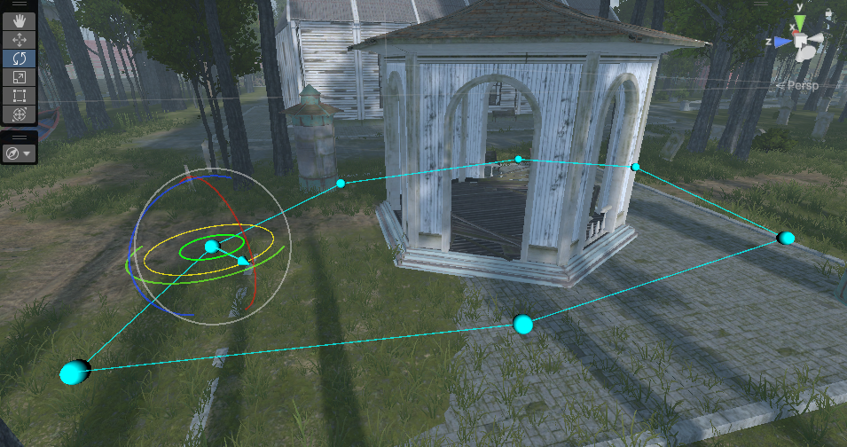

# Advanced Character & Enemy AI Controller in Unity

This project covers advanced movement, combat, and AI behaviors that react dynamically to the player’s actions — from stealth to full-on combat.

---

## 🎮 Character Controller Variations

Create a smooth and responsive movement system that adapts to your player’s actions.
You’ll implement:

* **Walking** – Standard movement with full control and realistic momentum.

🎥 **Demo Video:**

<video src="Walk.mp4" controls style="
    width: 100%;
    max-width: 720px;
    border-radius: 12px;
    box-shadow: 0 4px 16px rgba(0,0,0,0.25);
    display: block;
    margin: 1.5rem auto;
  ">
</video>

* **Sprinting** – Boost speed and camera shake with stamina or cooldown options.

🎥 **Demo Video:**

<video src="Sprint.mp4" controls style="
    width: 100%;
    max-width: 720px;
    border-radius: 12px;
    box-shadow: 0 4px 16px rgba(0,0,0,0.25);
    display: block;
    margin: 1.5rem auto;
  ">
</video>

* **Crouching** – Move silently and lower the detection radius for stealth mechanics.

🎥 **Demo Video:**

<video src="crouch.mp4" controls style="
    width: 100%;
    max-width: 720px;
    border-radius: 12px;
    box-shadow: 0 4px 16px rgba(0,0,0,0.25);
    display: block;
    margin: 1.5rem auto;
  ">
</video>

---

## ⚔️ Character Combat System

Add depth to your gameplay with an interactive combat system featuring:

* **Attacks** – Chain combos, trigger hitboxes, and apply damage.
* **Blocking** – Deflect or reduce incoming attacks with precise timing.
* **Target Lock-On** – Smoothly rotate and focus on nearby enemies for precision fighting.

The system supports both **offensive and defensive playstyles**, with flexible state management using scriptable state machines.

🎥 **Demo Video:**

<video src="fight.mp4" controls style="
    width: 100%;
    max-width: 720px;
    border-radius: 12px;
    box-shadow: 0 4px 16px rgba(0,0,0,0.25);
    display: block;
    margin: 1.5rem auto;
  ">
</video>

🎥 **Demo Video:**

<video src="fight2.mp4" controls style="
    width: 100%;
    max-width: 720px;
    border-radius: 12px;
    box-shadow: 0 4px 16px rgba(0,0,0,0.25);
    display: block;
    margin: 1.5rem auto;
  ">
</video>
---

## 🧠 Enemy Waypoints & Patrol Behavior

Design intelligent patrol paths using waypoints, allowing enemies to naturally navigate the environment.

* Define custom patrol routes per enemy.
* Use NavMesh Agents for dynamic pathfinding.
* Transition between **idle**, **patrolling**, and **investigating** states seamlessly.

**Demo :** 

---

## 👁️ Enemy Detection (Field of View System)

Give your enemies realistic vision with a **Field of View (FOV)** system:

* Adjustable **view angle** and **detection distance**.

---

## 👂 Enemy Hearing & Alertness System

A reactive sound detection system where enemies can **hear the player** based on sound loudness and their own alert state.

* Each sound (footsteps, attacks, etc.) carries a **loudness value**.
* Enemies become more aware as nearby sounds increase in intensity.

---

## 🕵️‍♂️ Realistic Player Noise Simulation

Enhance immersion with nuanced sound detection logic:

* **Running** from behind triggers enemy awareness.
* **Crouching** movement stays silent, even when close.

---

## 🗡️ Stealth Assassination System

Add stealth-based takedowns that reward strategic play:

* Perform **silent assassinations** from behind on unaware enemies.
* Automatically disable AI perception and behaviors on eliminated enemies.

🎥 **Demo Video:**

<video src="Assassination.mp4" controls style="
    width: 100%;
    max-width: 720px;
    border-radius: 12px;
    box-shadow: 0 4px 16px rgba(0,0,0,0.25);
    display: block;
    margin: 1.5rem auto;
  ">
</video>

