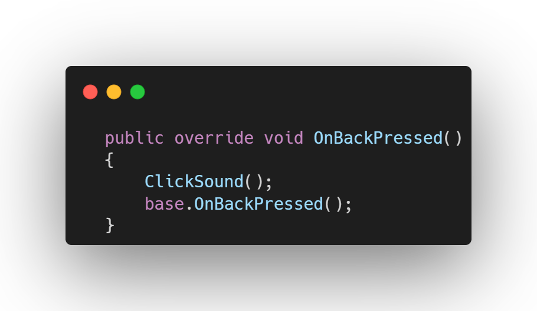
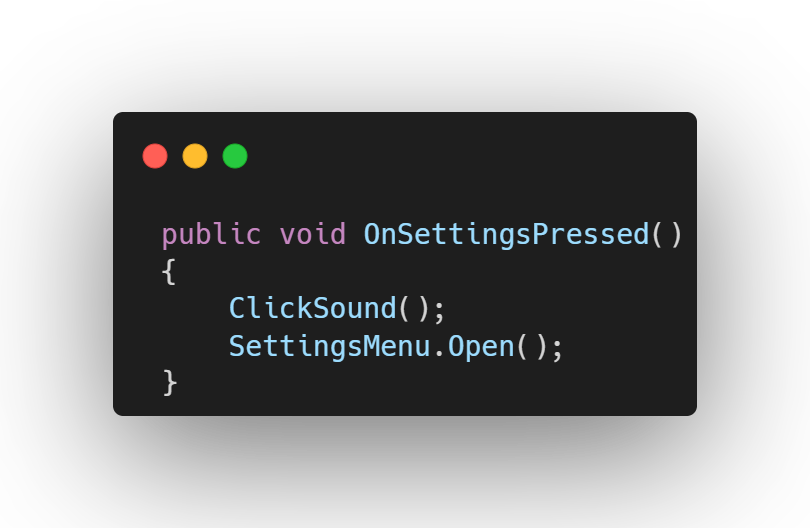
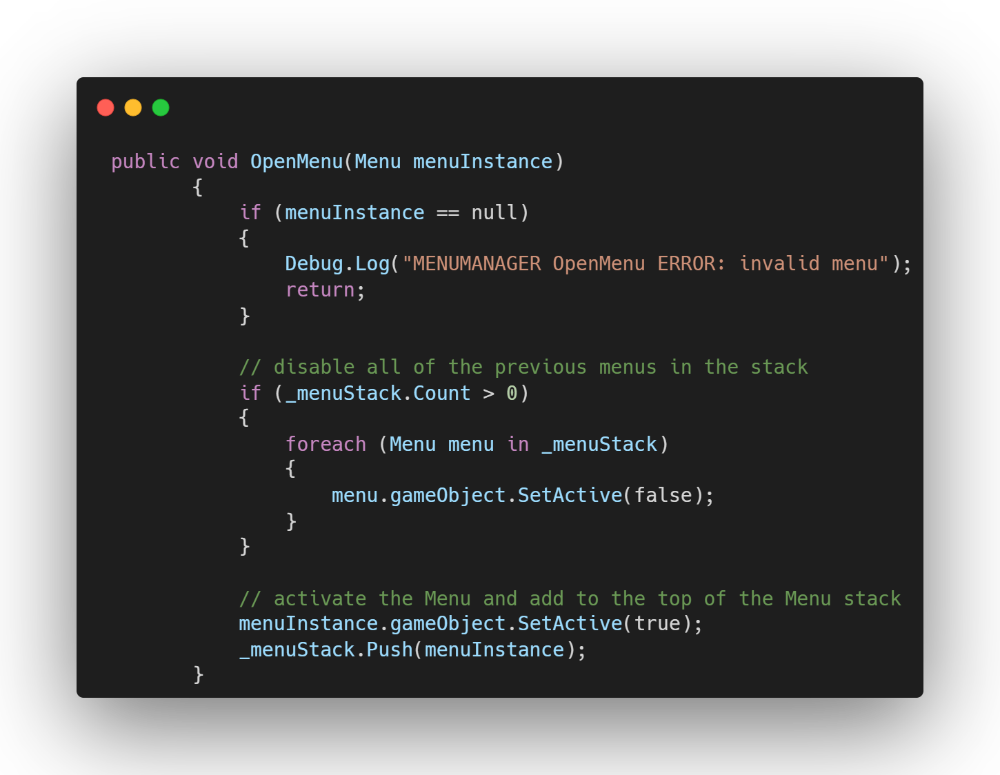
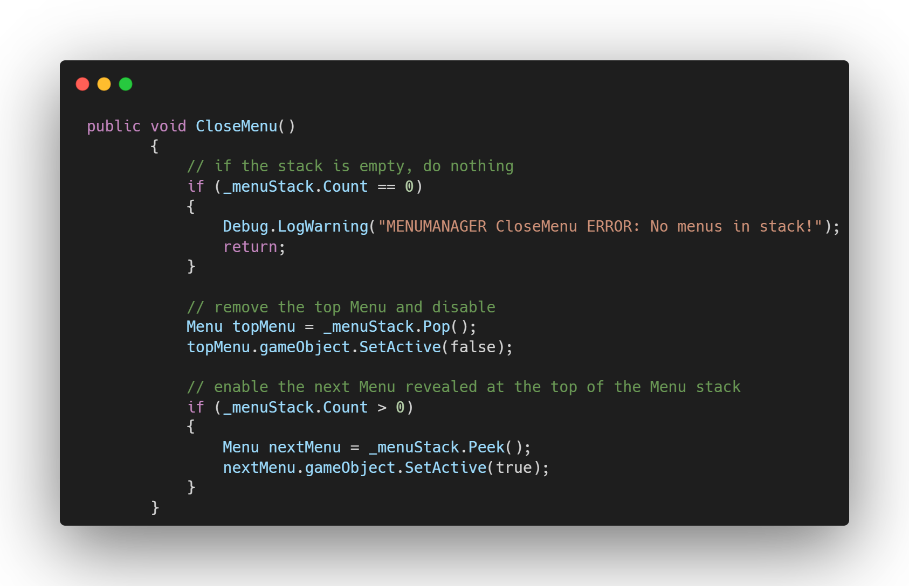

# A Simple and Scalable Menu Management System in Unity

Designing a clean and flexible game menu system is one of the core foundations of any polished Unity project. As your game grows, so do the menus — settings, inventory, pause screens, shops, crafting, dialogue windows, and more. Without a proper structure, your UI can quickly become messy and difficult to maintain.

This is a powerful yet simple approach to building a **Menu Management System** in Unity using:
- A **stack-based** system to handle menu panels.
- **Scriptable Objects** for clean, centralized configuration.
- **JSON-based data saving** using a Data Manager for easy persistence across your game.
---

## Why a Menu Management System?

Many games start with a few UI panels that are opened and closed manually. Over time, this approach becomes error-prone:
- Multiple menus may overlap incorrectly.
- Closing one panel may unexpectedly hide others.
- The escape/back button logic becomes messy.

A proper **Menu Manager** solves this by controlling all UI flow in one place.

---

## The Stack-Based Menu Approach

The core idea is simple:

### **Each menu panel is treated as an item on a stack.**

When a new panel opens, it is **pushed** onto the stack.
When you close the top panel, it is **popped**, revealing the previous one.

### Benefits:
- Only the active panel is visible.
- Opening a new menu automatically hides the previous one.
- Back navigation becomes trivial — just pop the stack.
- No need to manually track which menu is open.
- Works perfectly for nested menus:  
  *Main Menu → Settings → Controls → Confirm Dialog*

You always know the current open panel:  
**It’s the top of the stack.**

**Demo :** 

---

**Demo :** 

---

## Centralized Data Saving Using JSON

Many menus rely on data:
- Settings menus need audio/graphics values.
- Inventory menus load player items.
- Profile menus load user preferences.

To make this clean and reliable, you can use a **Data Manager** that handles:
- **Reading and writing JSON files**
- **Storing all persistent data in Scriptable Objects**
- **Auto-loading data on game start**
- **Saving data anytime from anywhere**

This avoids duplicating save logic across different UI scripts.

### Typical data handled:
- Player progress  
- Player settings  
- Inventory and currency  
- Quest states  
- UI preferences  

Everything becomes centralized and safe.

---

## The Data Manager Workflow

Your Data Manager class can follow this pattern:

### 1. On game start  
- Load all Scriptable Objects containing persistent data.
- Write their values from JSON into memory.

### 2. During gameplay  
- Any part of the game modifies the Scriptable Object values directly.
- Menus can read and write data immediately.

### 3. On save  
- The Data Manager converts all Scriptable Objects to JSON.
- Data is written to disk in one unified structure.

### Why this helps menus:
- All menu scripts simply update the Scriptable Object data.
- Saving becomes a single-line request to the Data Manager.

---

## Putting It All Together

Here’s how all systems work together in practice:

### **1. Opening a menu**
- Instantiates or activates the panel.
- Pushes the menu onto the stack.
- Hides the previous panel.

**Demo :** 

### **2. Closing a menu**
- Menu Manager pops the top panel.
- Deactivates it.
- Reactivates the previous panel (if any).

**Demo :** 

### **3. Reading/writing data**
- Menus get and set values stored in Scriptable Objects.
- Data Manager later saves these values as JSON.

---

## Benefits of This Architecture

### **Cleaner UI Flow**
No more manual toggling of menus. One system controls everything.

### **Easy Back Navigation**
The stack automatically manages menu history.

### **Centralized Configuration**
Scriptable Objects keep your menu information organized and editable.

### **Unified Saving System**
All game data is saved consistently through one Data Manager.

### **Reusable and Scalable**
Works for small prototypes and large commercial games.

---

🎥 **Demo Video:**

<video src="Demo.mp4" controls style="
    width: 100%;
    max-width: 720px;
    border-radius: 12px;
    box-shadow: 0 4px 16px rgba(0,0,0,0.25);
    display: block;
    margin: 1.5rem auto;
  ">
</video>