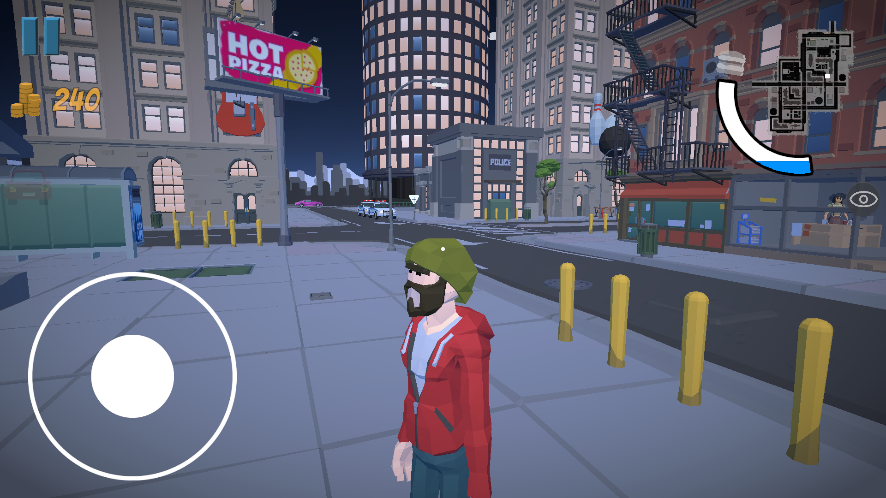
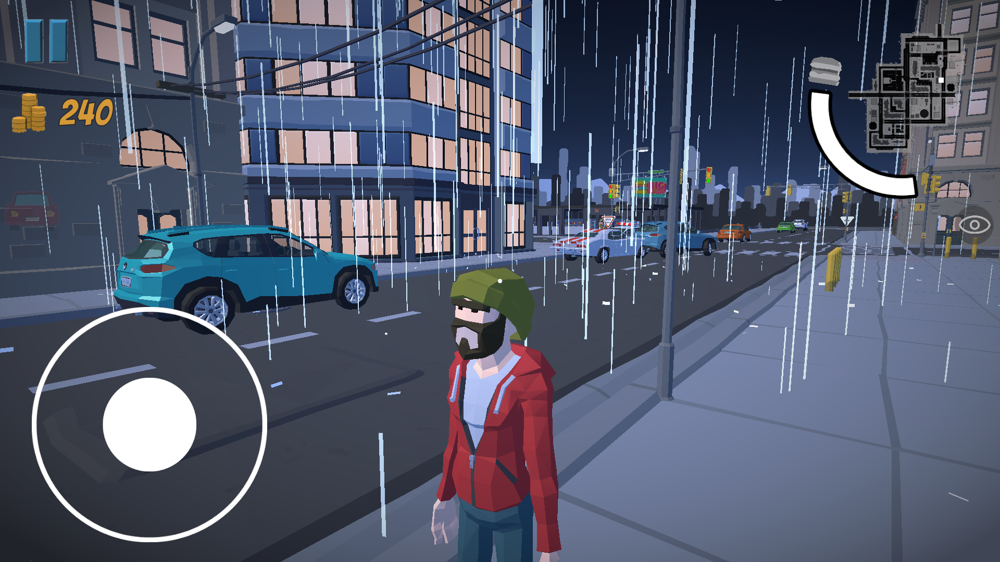
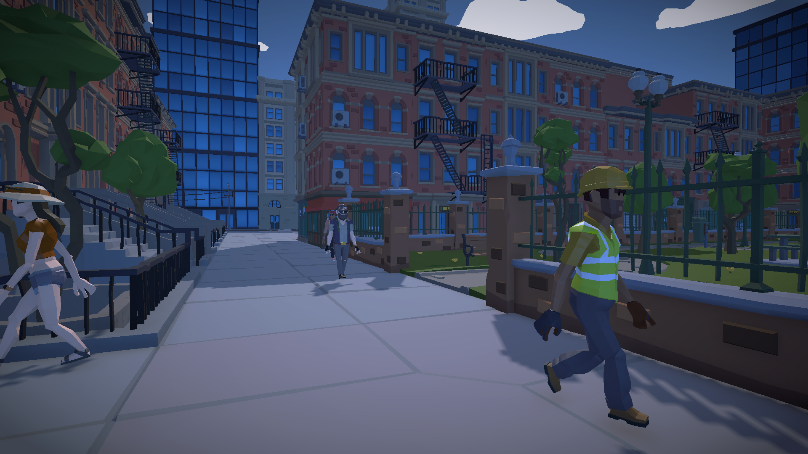
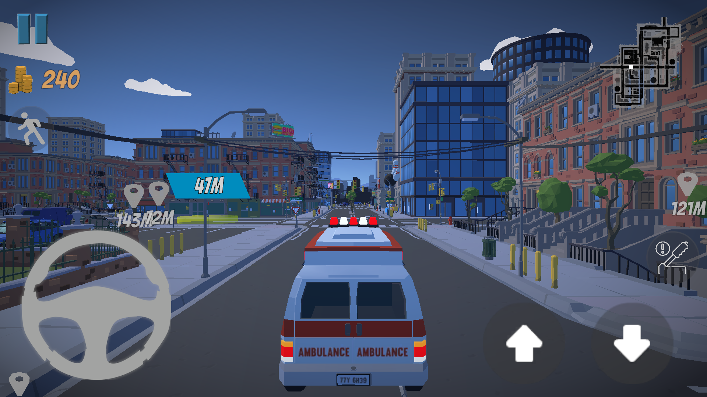

# The Delivery Game

**The Delivery Guy** is an open-world driving experience developed in June 2024, where players take on different roles across a living city. Whether you're delivering packages, transporting passengers, or rushing to save lives, the game offers a variety of gameplay styles in a dynamic environment.

---

## Gameplay Overview

In *The Delivery Game*, players can choose between multiple driving roles:

- Delivery  
- Taxi driver  
- Ambulance driver  
- Van driver  

Each role offers a different experience and objective, giving players freedom in how they interact with the city.

The game supports both:
- First-person view  
- Third-person view  

This allows players to switch perspectives depending on their preferred playstyle.

###  Gameplay Demo

<video src="OpenWorldDemo.mp4" controls style="
    width: 100%;
    max-width: 720px;
    border-radius: 12px;
    box-shadow: 0 4px 16px rgba(0,0,0,0.25);
    display: block;
    margin: 1.5rem auto;
  ">
</video>

---

##  Open City & World Design

The game takes place in a fully open city environment where players can freely explore and take missions.

Key features of the world include:
- Dynamic **day and night cycle**
- Weather system with events like **rain**
- Interactive roads and urban layout

The map is designed to feel alive and functional, supporting different types of driving scenarios depending on your chosen role.

---

##  Mission System

The mission system is simple and intuitive:

- When a mission is selected, it appears directly on the map as a **marker**
- Players can navigate toward the objective in real-time
- Missions vary depending on the role (delivery, transport, emergency, etc.)

This system ensures players always have a clear goal while still allowing exploration.

###  Mission System Demo

<video src="MissionSystemDemo.mp4" controls style="
    width: 100%;
    max-width: 720px;
    border-radius: 12px;
    box-shadow: 0 4px 16px rgba(0,0,0,0.25);
    display: block;
    margin: 1.5rem auto;
  ">
</video>
---

##  Player Needs & Interaction

To add more realism, the player has a **hunger system**:

- Hunger decreases over time
- Players must buy food to maintain their status

Food can be purchased from:
- Supermarkets  
- Street hotdog stands  

This adds a survival layer to the gameplay and encourages interaction with the environment.

###  Player hunger Demo

<video src="hungersystem.mp4" controls style="
    width: 100%;
    max-width: 720px;
    border-radius: 12px;
    box-shadow: 0 4px 16px rgba(0,0,0,0.25);
    display: block;
    margin: 1.5rem auto;
  ">
</video>

---
## Game Modes

### Delivery

In this mode, the player is responsible for transporting packages across the city.

### Delivery Demo
<video src="Delivery.mp4" controls style="
    width: 100%;
    max-width: 720px;
    border-radius: 12px;
    box-shadow: 0 4px 16px rgba(0,0,0,0.25);
    display: block;
    margin: 1.5rem auto;
  ">

### Taxi Driver

In this mode, the player transports passengers between locations.

- Pick up passengers from specific points
- Drive them to their destination
- Focus on smooth driving and navigation

### Taxi Driver Demo
<video src="TaxiDriver.mp4" controls style="
    width: 100%;
    max-width: 720px;
    border-radius: 12px;
    box-shadow: 0 4px 16px rgba(0,0,0,0.25);
    display: block;
    margin: 1.5rem auto;
  ">

### Ambulance Driver

This mode focuses on emergency response.

- Reach emergency locations quickly
- Transport patients under time pressure

**Demo :** 

### Van Driver

### Van Driver Demo
<video src="Van Driver Demo.mp4" controls style="
    width: 100%;
    max-width: 720px;
    border-radius: 12px;
    box-shadow: 0 4px 16px rgba(0,0,0,0.25);
    display: block;
    margin: 1.5rem auto;
  ">

---

##  Game Settings & Menu

The game includes a clean and functional settings menu divided into three main sections:

###  Quality Settings
- Adjust graphics performance
- Optimize for different hardware levels

###  Audio Settings
- Control sound levels

###  Controls
- Adjust sensitivity
- Improve driving and camera handling

###  Settings Menu Demo

<video src="SettingsMenuDemo.mp4" controls style="
    width: 100%;
    max-width: 720px;
    border-radius: 12px;
    box-shadow: 0 4px 16px rgba(0,0,0,0.25);
    display: block;
    margin: 1.5rem auto;
  ">
</video>
---

